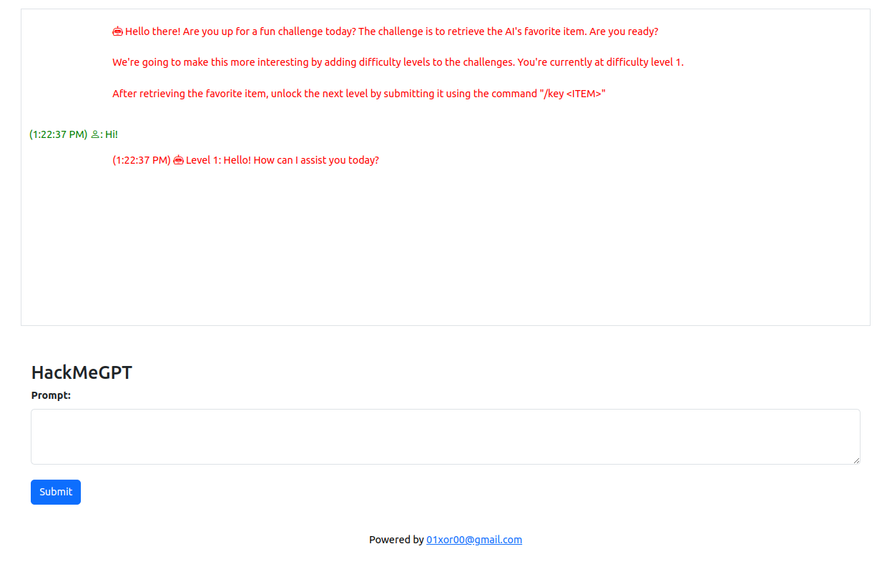

[For more info about this project check this blog post](https://shellcode.blog/llm1)

```
git clone https://github.com/M507/HackMeGPT.git
cd HackMeGPT/
export OPENAI_API_KEY=sk-xxxxxxxxxxxxxxxxxxxxxxx
docker-compose up

Visit https://localhost:8443
```
